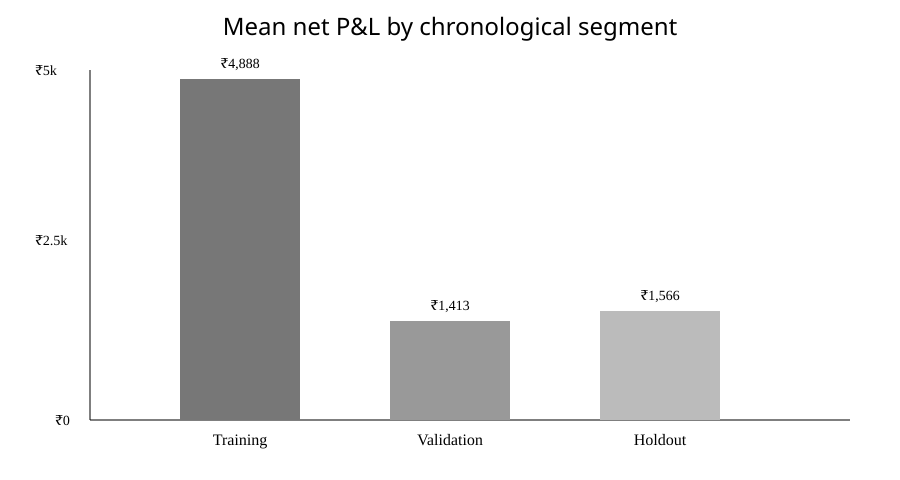
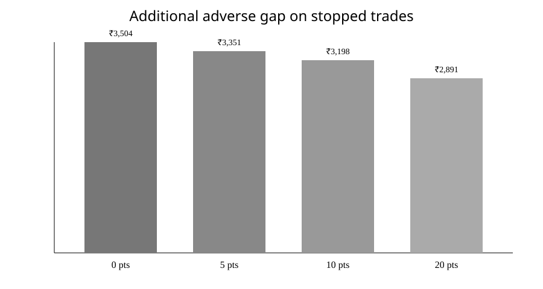

# Weekly NIFTY Call-Ladder-to-Spread Strategy: Empirical Backtest, Robustness Audit and Untouched Holdout

## Abstract
This study evaluates a video-derived weekly NIFTY options strategy operationalized as one trade cycle per weekly expiry. The strategy selects three call strikes using a premium-difference rule, enters a pre-lock call ladder, buys the middle strike before expiry, and thereby converts the post-lock position into a bounded K1/K3 bull-call spread. The empirical pipeline uses 1-minute OHLC data from a Hugging Face source, explicit dated transaction costs, Paytm Money brokerage parameterization, slippage stress, stop-loss stress, chronological train/validation/holdout separation, block bootstrap, multiple-testing correction, a CSCV-style overfitting diagnostic, a DSR-style diagnostic, regime conditioning and execution-gap stress.

The final frozen configuration used 0.50 index points of slippage per leg and a 50-point hard stop. Across 63 usable weekly cycles, the reconstructed mean net P&L was ₹3,488.06 per cycle and the annualized weekly Sharpe was 4.37. The 14-cycle untouched holdout produced mean net P&L of ₹1,566.04 per cycle, 78.57% winning cycles and annualized weekly Sharpe 2.02. The Phase 12 frozen-cell robustness audit produced mean ₹3,503.86 per cycle, annualized weekly Sharpe 4.42, block-bootstrap two-sided p=0.0002 and Holm-adjusted p=0.006 across the 30-cell candidate grid. A CSCV-style PBO proxy was 0.00 and the DSR-style probability was 0.9892, but both are implementation-specific diagnostics rather than exact reproductions of the published estimators.

These results are historical OHLC reconstructions, not evidence of realized executable fills. The primary data do not contain historical bid/ask quotes, and historical NSE SPAN/peak-margin series has not yet been integrated. Consequently the study does not report a capital-normalized return and does not establish live-trading performance.

## 1. Research questions
1. Can the video-derived weekly strategy be expressed as a deterministic, reproducible set of entry, strike-selection, lock and exit rules?
2. Does the reconstructed strategy retain positive net P&L after dated brokerage, statutory charges and explicit slippage?
3. How sensitive are the results to slippage and hard-stop assumptions?
4. Does the selected configuration remain positive across chronological training, validation and an untouched holdout?
5. How do results vary across the historical weekly-expiry regime, lot-size regime and K3 target-error regime?
6. What is the effect of additional execution-gap stress on stopped trades?
7. How much evidence of selection bias remains after accounting for the 30-cell parameter grid?
8. What additional data are required before capital-normalized or executable-fill conclusions can be made?

## 2. Aims and objectives
### Aim
To perform a reproducible empirical evaluation of a weekly NIFTY options strategy while explicitly accounting for transaction costs, slippage, stop-loss sensitivity, chronological out-of-sample testing and statistical selection effects.

### Objectives
- Freeze the strategy mechanics before empirical evaluation.
- Construct weekly cycles from 1-minute NIFTY option and spot data.
- Apply dated cost schedules and broker-specific brokerage assumptions.
- Evaluate a 30-cell slippage × stop-loss stress matrix.
- Freeze the hard stop using training data only.
- Evaluate validation and untouched holdout performance without tuning on the holdout.
- Apply dependence-aware and multiple-testing-aware robustness diagnostics.
- Quantify regime and execution-gap sensitivity.
- Document data-quality, margin and reproducibility limitations.

## 3. Strategy specification
Each weekly cycle uses three call strikes K1<K2<K3. K1 is the first call strike above spot, K2 is the next call strike, and K3 is the higher strike whose premium is closest to the target implied by twice the K1-minus-K2 premium difference. Entry is defined using the first eligible session at 10:00 IST. K2 is bought on the trading day immediately before expiry at the specified lock time. The post-lock position is long K1 / short K3.

The pre-lock structure is a call ladder and therefore has materially different risk characteristics from the post-lock bull-call spread. The hard stop is applied during both pre-lock and post-lock states according to the frozen backtest mechanics. One primary trade is allowed per weekly expiry.

## 4. Data and sample construction
The primary data source is a 1-minute NIFTY index-options dataset on Hugging Face, supplemented by a separate NIFTY spot series. The ingestion workflow resolved 100 expiry candidates and identified 63 usable OHLC weekly cycles. Third-party raw data are not redistributed in the public repository; the workflow records source/revision information and caches downloads in GitHub Actions.

The principal execution-quality limitation is that the primary source contains OHLC, volume and open interest rather than historical bid/ask quotes. Prices are therefore reconstructed from bar observations. This limitation is central to interpretation.

## 5. Transaction-cost and execution model
The model includes Paytm Money brokerage parameterization, dated exchange transaction charges, STT, SEBI turnover charges, IPFT proxy, stamp duty, GST and explicit per-leg slippage. Lot size changes are represented using 75 lots before the 2026 transition and 65 lots from the new regime used by the backtest.

Slippage stress uses 0, 0.25, 0.50, 1.00 and 2.00 index points per leg. The primary frozen configuration uses 0.50 points per leg. Historical SPAN/peak-margin data are not integrated; therefore P&L is reported in rupees per cycle rather than as a return on margin or capital.

## 6. Statistical methodology
### 6.1 Chronological split
The 63 usable cycles are divided chronologically into 37 training cycles, 12 validation cycles and 14 untouched holdout cycles. The hard-stop candidate is selected using training data only.

### 6.2 Stress matrix
Thirty configurations are evaluated: five slippage assumptions × six stop-loss assumptions. The Phase 13 frozen configuration is 0.50 slippage points per leg and a 50-point hard stop.

### 6.3 Block bootstrap
Weekly net P&L is resampled with four-week blocks and 5,000 bootstrap replications. This is intended to reduce the anti-conservative effect of treating adjacent weekly observations as independent.

### 6.4 Multiple-testing adjustment
Two-sided bootstrap p-values for all 30 candidate cells are adjusted with the Holm step-down procedure. For the frozen cell, the raw two-sided bootstrap p-value is 0.0002 and the Holm-adjusted value is 0.006.

### 6.5 CSCV/PBO diagnostic
A six-block, three-test-block combinatorial split with a one-week purge produces 20 paths. The repository reports a PBO proxy equal to the fraction of paths in which the training-selected configuration falls below the median test percentile. The proxy is 0.00. Because this is a repository-specific diagnostic rather than an exact reproduction of the published estimator, it is treated as supporting evidence rather than a definitive probability of backtest overfitting.

### 6.6 DSR-style diagnostic
A DSR-style approximation incorporates the 30-trial multiple-testing burden and non-normality of the frozen-cell return series. The resulting probability is 0.9892, with annualized weekly Sharpe 4.42. This is explicitly not a byte-for-byte implementation of the published DSR estimator.

### 6.7 Regime conditioning
Descriptive subgroup analysis is performed for the historical contract-rule era, lot-size regime and K3 target-error regime. These groups are not used for parameter selection.

### 6.8 Tail execution-gap stress
An additional 0, 5, 10 and 20 index-point adverse gap is applied to stopped trades to test the effect of worse-than-modeled stop execution.

## 7. Results
### 7.1 Chronological performance
| Segment | n | Total net P&L (₹) | Mean/cycle (₹) | Win rate | Annualized weekly Sharpe |
|---|---:|---:|---:|---:|---:|
| Training | 37 | 180,867.62 | 4,888.31 | 83.78% | 6.82 |
| Validation | 12 | 16,955.48 | 1,412.96 | 75.00% | 1.49 |
| Untouched holdout | 14 | 21,924.63 | 1,566.04 | 78.57% | 2.02 |
| All cycles | 63 | 219,747.72 | 3,488.06 | 80.95% | 4.37 |

### 7.2 Frozen robustness cell
The 0.50-point-slippage / 50-point-stop cell contains 63 weekly cycles, mean net P&L ₹3,503.86 per cycle and annualized weekly Sharpe 4.42. The corresponding two-sided block-bootstrap p-value is 0.0002; Holm-adjusted across 30 candidate cells it is 0.006.

### 7.3 Combinatorial robustness
The CSCV-style diagnostic generated 20 paths. The training-selected configuration had a below-median test percentile on none of the paths, giving a PBO proxy of 0.00. The median logit test percentile was 2.603. One path selected a 0.00-slippage/150-point-stop configuration in training and produced a negative test mean, demonstrating that parameter instability can occur even when the overall diagnostic remains favorable.

### 7.4 Regime conditioning
| Regime | n | Mean net P&L/cycle (₹) | Win rate | Annualized weekly Sharpe |
|---|---:|---:|---:|---:|
| Pre-2025-08-28 contract-rule era | 43 | 4,275.11 | 83.72% | 5.66 |
| Post-2025-08-28 contract-rule era | 20 | 1,845.67 | 75.00% | 2.19 |
| 75-lot regime | 52 | 3,969.05 | 80.77% | 5.07 |
| 65-lot regime | 11 | 1,304.76 | 81.82% | 1.62 |
| Low target error | 21 | 3,743.34 | 85.71% | 5.37 |
| Mid target error | 21 | 4,183.50 | 80.95% | 5.69 |
| High target error | 21 | 2,584.73 | 76.19% | 2.73 |

These subgroup results are descriptive. The smaller post-change and 65-lot samples make their estimates less precise than the full sample.

### 7.5 Tail execution-gap stress
| Additional adverse gap on stopped trades | Mean net P&L/cycle (₹) | Annualized weekly Sharpe |
|---:|---:|---:|
| 0 points | 3,503.86 | 4.42 |
| 5 points | 3,350.68 | 4.26 |
| 10 points | 3,197.51 | 4.09 |
| 20 points | 2,891.16 | 3.74 |

Twenty-six of the 63 frozen-cell cycles were stopped. The additional-gap analysis therefore provides a direct sensitivity check on a material subset of trades.

## 8. Inferences
Within the limits of the historical reconstruction, the strategy produced positive net P&L in training, validation and the untouched holdout under the frozen configuration. The reduction from training mean P&L to validation and holdout mean P&L is material and should be treated as part of the evidence rather than averaged away.

The robustness matrix indicates that the frozen cell is not an isolated positive observation: the surrounding slippage/stop grid was also evaluated. Multiple-testing correction leaves the frozen cell's adjusted bootstrap p-value at 0.006. The CSCV-style diagnostic does not show below-median test performance for the training-selected configuration in its 20 paths, while the DSR-style approximation gives 0.9892. These diagnostics support further investigation but do not eliminate model, data, execution or selection uncertainty.

The regime analysis indicates lower reconstructed mean P&L after the weekly-expiry rule change and under the 65-lot regime. Because these periods are shorter, the result should be treated as a regime-sensitivity signal rather than a stable structural parameter.

## 9. Discussion
### 9.1 Interpretation
The study's strongest empirical observation is the persistence of positive reconstructed net P&L into the 14-cycle holdout after a training-only hard-stop selection. The holdout is small, so its estimates remain uncertain. The validation mean is also substantially lower than the training mean, which is consistent with some degree of performance decay outside the training sample.

The strategy's economic interpretation is complicated by the strike-grid construction of K3. The target premium is continuous in the mathematical rule, whereas listed option strikes are discrete. Target-error conditioning shows lower mean P&L in the highest-error subgroup, supporting continued monitoring of implementation error.

### 9.2 Execution realism
OHLC reconstruction is the principal empirical limitation. A bar open is not equivalent to a guaranteed executable quote, and multi-leg options strategies can experience asynchronous fills, spread widening and queue effects. The tail-gap analysis partially addresses this by adding adverse stop execution, but it does not substitute for historical bid/ask or order-book data.

### 9.3 Capital realism
Positive rupee P&L cannot be translated into a capital return without the dated margin requirement, collateral policy, intraday exposure and peak SPAN margin. The manuscript therefore deliberately does not report a percentage return on capital.

### 9.4 Statistical interpretation
The 30-cell grid creates a multiple-comparison problem, which is explicitly addressed with Holm correction and a DSR-style diagnostic. Dependence is addressed through block bootstrap and a one-week purge in the CSCV-style analysis. Nevertheless, the sample contains only 63 usable weekly cycles, limiting the precision of all statistical estimates.

## 10. Strengths
- Explicitly frozen weekly strategy mechanics.
- Chronological train/validation/holdout separation.
- One trade per weekly expiry, avoiding arbitrary trade-frequency inflation.
- Dated transaction-cost and brokerage model.
- 30-cell slippage × stop-loss sensitivity analysis.
- Multiple-testing adjustment across candidate configurations.
- Dependence-aware bootstrap.
- CSCV-style and DSR-style diagnostics with methodological caveats.
- Regime and target-error conditioning.
- Additional adverse execution-gap stress.
- Reproducible GitHub Actions workflow with cached Hugging Face data.

## 11. Limitations
1. Historical bid/ask and order-book data are unavailable in the primary dataset.
2. OHLC reconstruction can differ materially from executable multi-leg fills.
3. Only 63 weekly cycles are usable in the current data gate.
4. The holdout contains only 14 cycles.
5. Historical SPAN/peak-margin series is not integrated, preventing capital-normalized returns.
6. The PBO and DSR diagnostics are approximations implemented for this repository and should not be interpreted as exact published-estimator replications.
7. The holdout was inspected before the later Phase 12 supplemental audit. It is therefore locked descriptively and cannot be used for subsequent tuning.
8. The study does not model all possible broker-specific order-routing, liquidity or market-impact effects.

## 12. Conclusion
The frozen weekly NIFTY strategy produced positive reconstructed net P&L in training, validation and the untouched 14-cycle holdout, after the modeled transaction costs and 0.50-point-per-leg slippage. The surrounding 30-cell stress matrix, Holm adjustment, block bootstrap, CSCV-style diagnostic, DSR-style approximation and execution-gap stress provide multiple independent robustness views.

At the same time, the evidence is not sufficient to equate the backtest with realized tradable performance. The primary data lack historical bid/ask quotes, the sample is limited to 63 usable weekly cycles, and historical margin requirements are not integrated. The appropriate research conclusion is therefore that the strategy merits further controlled investigation under higher-quality execution and margin data, not that live profitability has been established.

## 13. Future research
1. Integrate dated NSE SPAN/peak-margin files and compute return on deployed/peak capital.
2. Obtain historical bid/ask or order-book data for the exact option legs and timestamps.
3. Re-run the full protocol with executable bid/ask rules rather than OHLC reconstruction.
4. Expand the sample across more weekly cycles and additional volatility regimes.
5. Independently reproduce the PBO and DSR estimators against published reference implementations.
6. Add FII/DII positioning, volatility indices, global-market crossing effects, gold and major risk indices, corporate actions and event/news regime labels where temporally admissible.
7. Evaluate liquidity, open-interest concentration, strike depth and multi-leg execution sequencing.
8. Perform a genuinely untouched future/live-paper-trading period after the protocol is frozen.

## 14. Reproducibility and repository artifacts
- Phase 8W: strategy specification and research protocol.
- Phase 9W: HF data ingestion and weekly cycle manifest.
- Phase 10W: mechanics, costs and margin framework.
- Phase 11W: weekly backtest engine.
- Phase 12W: 30-cell robustness matrix and supplemental diagnostics.
- Phase 13W: frozen stop selection and untouched holdout.
- Phase 14W: this manuscript and figures.

## Appendix A — Frozen rule
- Slippage: 0.50 index points per leg.
- Hard stop: 50 index points.
- Candidate stops considered during training: 25, 50, 75, 100, 150, 200, 300.
- Selection statistic: training mean net P&L, then lower training maximum drawdown, then lower stop.

## Appendix B — Primary numerical outputs
The machine-readable outputs are stored in the Phase 12 branch under `research/phase12_weekly/robustness.json` and `research/phase12_weekly/robustness_supplement.json`, and the Phase 13 frozen result is stored under `research/phase13_weekly/holdout.json`.

## Appendix C — Interpretation guardrails
- Net rupees are not capital returns.
- OHLC reconstruction is not proof of executable fills.
- The holdout is descriptive and locked against later tuning.
- Approximate PBO/DSR diagnostics are not exact estimator replications.

## Supplementary materials
- Supplementary robustness JSON: `research/phase12_weekly/robustness_supplement.json`.
- Primary 30-cell robustness JSON: `research/phase12_weekly/robustness.json`.
- Frozen holdout JSON: `research/phase13_weekly/holdout.json`.
- Research error log: `research/logs/ERROR_LOG.md`.
- Research execution log: `research/logs/RESEARCH_LOG.md`.
## References
1. Bailey, D. H., Borwein, J. M., López de Prado, M., & Zhu, Q. J. (2017). *The Probability of Backtest Overfitting*. Journal of Computational Finance, 20(4), 39–70. DOI: 10.21314/JCF.2016.322. The paper develops the PBO/CSCV framework for investment backtests. citeturn0search1turn0search14
2. Bailey, D. H., & López de Prado, M. (2014). *The Deflated Sharpe Ratio: Correcting for Selection Bias, Backtest Overfitting and Non-Normality*. Journal of Portfolio Management, 40(5), 94–107. DOI: 10.2139/ssrn.2460551. The paper motivates correcting Sharpe-based inference for multiple testing and non-normality. citeturn0search0
3. White, H. (2000). *A Reality Check for Data Snooping*. Econometrica, 68(5), 1097–1126. DOI: 10.1111/1468-0262.00152. This work formalizes the data-snooping problem in specification searches and motivates bootstrap-based correction. citeturn1search0turn1search1
4. Sullivan, R., Timmermann, A., & White, H. (1999). *Data-Snooping, Technical Trading Rule Performance, and the Bootstrap*. Journal of Finance, 54, 1647–1691. DOI: 10.1111/0022-1082.00163. The study applies White's bootstrap reality-check framework to technical trading rules. citeturn1search5turn1search6
5. Holm, S. (1979). *A Simple Sequentially Rejective Multiple Test Procedure*. Scandinavian Journal of Statistics, 6(2), 65–70. This is the foundational reference for the Holm step-down multiple-testing procedure. citeturn1search4
