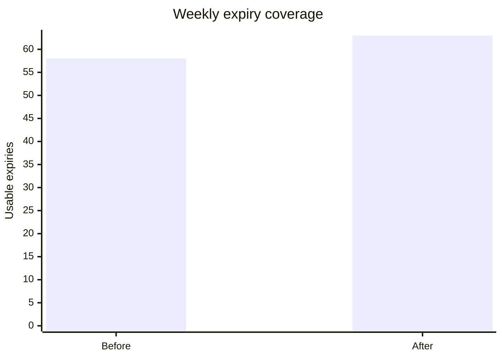
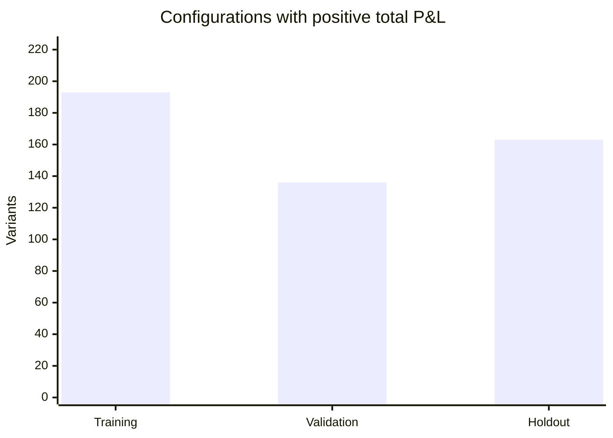
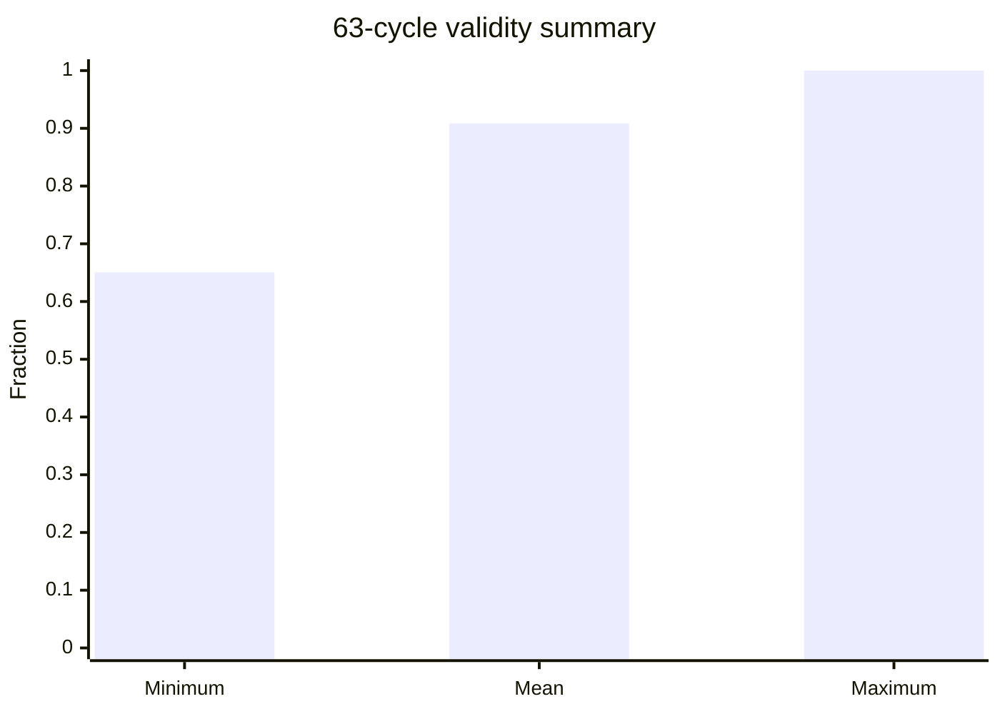

# Phase 21W Final Manuscript — Weekly NIFTY Strike-Alternative Recovery and 63-Expiry Reassessment

## Abstract

This phase completed the previously incomplete weekly NIFTY strike-alternative experiment by recovering the five missing holdout expiries with an immutable external options-data snapshot and rerunning the frozen 224-variant engine over the full 63-expiry calendar. The recovered source was the Hugging Face dataset `rissin/nse-options-intraday`, immutable revision `8f7739cab3f38abdcbc6332a6d0a83e1341326e3`, file `upstox_intraday/NIFTY/NIFTY_2026.parquet`, SHA-256 `bae9943b2fa99ee9c1214fb7c695b84f9f661a050a5cd04d9c5c2ffc7bc59f73`. All five target expiries admitted all 224 variants, adding 1,120 previously missing variant-cycle cells. The final merged input contained 12,822 admitted variant-cycle cells spanning all 63 expiries.

The frozen 224-variant experiment was rerun with the previously registered weekly protocol: chronological 37/12/14 train/validation/holdout split, 10:00 IST entry, 14:00 IST lock, 50-point stop, 0.50 NIFTY-point slippage per leg, and the existing Paytm Money/NSE transaction-cost model. The final run completed successfully for all 224 variants. Mean holdout net P&L across variants was ₹33,660.78 per variant-cycle aggregation, and 163/224 variants had positive holdout total net P&L; these variant-level totals are not additive and must not be interpreted as a portfolio return. The minimum 63-cycle validity rate was 0.6508 and the mean was 0.9086. The preregistered promotion gate requires at least 50/63 valid cycles, positive training mean net P&L, positive validation mean net P&L, at least 30 training observations, at least 8 validation observations, and Holm-adjusted training bootstrap p < 0.05. Zero of the 224 variants satisfied all conditions. The minimum Holm-adjusted training p-value was 0.07464.

The final evidence therefore resolves the data-availability problem but does not establish a capital-phase candidate under the frozen promotion protocol. Several variants generated positive holdout outcomes, but the experiment-wide multiple-testing correction and preregistered gate provide no admissible promoted configuration. This result should be interpreted as a completed falsification/selection phase rather than a deployable live-trading conclusion.

## 1. Research Questions

1. Can the five missing weekly holdout expiries be recovered from an independent historical 1-minute NIFTY options source without synthetic bars, strike substitution, or cross-source mixing?
2. After restoring the full 63-expiry calendar, do any of the frozen 224 K1/K2/K3 strike configurations satisfy the preregistered capital-promotion gate?
3. Are the previously observed positive training/validation/holdout outcomes robust to restoration of the missing holdout segment and Holm correction across all 224 configurations?
4. What evidence remains for future research after the completion of this frozen weekly experiment?

## 2. Study Design

### 2.1 Configuration space

The frozen configuration set contains 224 deterministic variants:

- 8 K1 rules: OTM1, OTM2, OTM3, ATM_NEAREST, ATM_UP, ITM1, ITM2, ITM3.
- 4 K2 rules: NEXT1, NEXT2, NEXT3, MIRROR_GAP.
- 7 K3 multipliers: 0.5, 1.0, 1.5, 2.0, 2.5, 3.0, 4.0.

### 2.2 Chronological protocol

The 63-expiry calendar is split chronologically into:

| Segment | Cycles |
|---|---:|
| Training | 37 |
| Validation | 12 |
| Holdout | 14 |
| Total | 63 |

The holdout was not used for parameter tuning after the experiment was frozen.

### 2.3 Frozen execution assumptions

Entry time is 10:00 IST and position lock is 14:00 IST. The frozen strategy implementation applies a 50-point hard stop and 0.50 NIFTY-point slippage per leg. Transaction costs follow the pre-existing Paytm Money/NSE model used by the registered experiment. The recovered source data were admitted only when exact observations existed at the frozen entry/lock timestamps for all three selected legs.

## 3. Data Recovery and Provenance

Five expiries were completely absent from the previously admitted weekly input:

- 2026-01-13
- 2026-02-10
- 2026-03-10
- 2026-04-13
- 2026-05-12

The external source was pinned to the immutable RISSIN snapshot `8f7739cab3f38abdcbc6332a6d0a83e1341326e3`. The 2026 NIFTY parquet passed the exact-source admission contract.

| Expiry | Entry spot | Entry strikes observed | Source rows | Variants admitted |
|---|---:|---:|---:|---:|
| 2026-01-13 | 26,138.95 | 49 | 133,231 | 224 |
| 2026-02-10 | 25,779.55 | 66 | 152,128 | 224 |
| 2026-03-10 | 24,325.80 | 85 | 168,515 | 224 |
| 2026-04-13 | 23,898.80 | 71 | 133,028 | 224 |
| 2026-05-12 | 24,140.60 | 63 | 146,598 | 224 |

All five targets therefore supplied 1,120 recovered variant-cycle cells.

### 3.1 Coverage reconciliation

| Coverage measure | Before recovery | After recovery |
|---|---:|---:|
| Weekly expiries | 58/63 | 63/63 |
| Variant-cycle cells | 11,702 | 12,822 |
| Missing expiries | 5 | 0 |
| External cells added | 0 | 1,120 |
| Cycle overlap with frozen base | — | 0 |
| Duplicate external bar groups | — | 0 |

The merged input passed the exact coverage gate: 12,822 combined cycle cells and 12,822 logical bar variant-cycle cells, with all 63 expiries represented.

## 4. Statistical Methodology

For every configuration, the frozen engine reported training, validation, and holdout net P&L, mean P&L, median P&L, win rate, maximum drawdown, expected shortfall, mean transaction cost and annualized weekly Sharpe.

The training significance screen uses a centered block bootstrap p-value. Because 224 configurations were examined simultaneously, training p-values were adjusted with the Holm multiple-testing procedure.

The promotion gate is deterministic:

1. 63-cycle validity rate >= 50/63.
2. Training observations >= 30.
3. Training mean net P&L > 0.
4. Validation observations >= 8.
5. Validation mean net P&L > 0.
6. Holm-adjusted training p < 0.05.

No change to the frozen engine was introduced during the recovery rerun.

## 5. Final Results

### 5.1 Overall variant distributions

| Metric | Result |
|---|---:|
| Variants evaluated | 224 |
| Positive training total P&L | 193/224 |
| Positive validation total P&L | 136/224 |
| Positive holdout total P&L | 163/224 |
| Mean training total P&L across variants | ₹83,517.66 |
| Mean validation total P&L across variants | ₹4,960.88 |
| Mean holdout total P&L across variants | ₹33,660.78 |
| Mean holdout annualized weekly Sharpe | 2.357 |
| Positive holdout Sharpe | 163/224 |
| Minimum validity rate | 41/63 = 0.6508 |
| Mean validity rate | 0.9086 |
| Maximum validity rate | 63/63 = 1.0000 |
| Minimum Holm-adjusted training p | 0.07464 |
| Variants passing all promotion conditions | 0/224 |

The positive-variant counts above are descriptive configuration-level results, not independent observations and not an estimate of a tradable portfolio.

### 5.2 P&L distribution across the 224 variants

| Quantile | Training total P&L | Validation total P&L | Holdout total P&L |
|---|---:|---:|---:|
| 10th percentile | ₹-50,543.54 | ₹-25,895.29 | ₹-23,219.02 |
| 25th percentile | ₹45,234.33 | ₹-12,053.22 | ₹-2,345.05 |
| Median | ₹85,163.37 | ₹5,930.33 | ₹37,014.51 |
| 75th percentile | ₹138,685.68 | ₹18,584.34 | ₹64,300.09 |
| 90th percentile | ₹187,424.98 | ₹38,281.15 | ₹92,401.17 |

### 5.3 Multiple-testing result

The minimum Holm-adjusted training p-value was 0.07464, above the preregistered 0.05 threshold. This prevents any variant from satisfying the full promotion gate even where raw bootstrap p-values were small.

This is important because the unadjusted training distribution contains configurations with very small raw bootstrap p-values, but the experiment evaluates 224 candidate configurations. The Holm correction is therefore part of the frozen inferential protocol, not an optional post-hoc filter.

## 6. Interpretation

The source-recovery question is resolved positively: the five missing holdout expiries could be reconstructed from a single immutable external archive, with all 224 variants passing exact entry/lock observation checks for each target.

The strategy-selection question is resolved negatively under the preregistered gate: zero of the 224 variants qualify for capital-phase promotion.

The final evidence also changes the interpretation of the earlier incomplete run. Before recovery, the experiment could not make a valid 63-expiry holdout statement because five holdout expiries were absent. After recovery, the complete holdout is available, and although many variants retain positive holdout P&L, the experiment-wide selection criterion still does not produce an admissible promoted configuration.

No live-profitability conclusion is established. The results are reconstructed historical P&L under OHLC-derived execution assumptions, a fixed slippage model and the specified transaction-cost model, not verified historical bid/ask fills.

## 7. Strengths

1. Frozen protocol preservation: the 224 variants, chronological split, stop rule, slippage and cost model were not retuned during recovery.
2. Explicit source provenance: immutable dataset revision and file SHA-256 were recorded.
3. Exact five-expiry recovery: no synthetic interpolation, strike substitution or cross-source leg mixing.
4. Full multiple-testing correction: Holm adjustment was applied across all 224 configurations.
5. Independent validation and untouched holdout structure remained unchanged.

## 8. Limitations

1. Historical option OHLC is not equivalent to historical executable bid/ask quotes.
2. The recovered external archive is not guaranteed to reproduce the exact exchange microstructure, queue position or fill quality that would have been available to a live trader.
3. The 14-cycle holdout is modest in sample size, so tail-risk and regime dependence remain material.
4. Variant-level P&L totals overlap heavily in the underlying market periods and are not independent samples or an investable portfolio.
5. Capital/margin normalization and execution-quality validation remain downstream tasks.
6. The frozen weekly experiment does not by itself establish robustness across intraday parameter timing, alternative position sizing or future unseen regimes.

## 9. Conclusion

Phase 21W completed the missing-data problem and delivered the intended 63-expiry, 224-variant historical reassessment. All five missing holdout expiries were recovered with 224/224 usable variants, producing 63/63 expiry coverage and 12,822 admitted variant-cycle cells.

The final preregistered promotion test yielded 0/224 qualifying configurations. The decisive inferential constraint was the experiment-wide Holm-adjusted training threshold: the minimum adjusted p-value was 0.07464. Therefore the completed evidence does not support promoting any configuration into the next capital-phase execution study under the frozen protocol.

The appropriate research conclusion is that the weekly strike-alternative hypothesis has not produced a statistically admissible capital-phase candidate within the tested 224-cell configuration space and current historical-data/execution assumptions.

## 10. Future Research

1. Phase 16-style capital and margin validation should remain a separate downstream study rather than being inferred from these P&L outputs.
2. Obtain historical option bid/ask or order-book data with reliable timestamps to replace OHLC execution reconstruction.
3. Extend the historical sample across additional years and market regimes before changing the frozen gate.
4. Pre-register any new hypothesis or parameter extension before inspecting the next holdout.
5. Test whether execution-aware costs and liquidity constraints materially change the distribution of variant outcomes.
6. Treat any future capital-phase candidate as a new, separately validated research stage rather than carrying forward a post-hoc selection from this completed run.

## 11. Reproducibility and Audit Trail

Key artifacts:

- `output/rissin_source_manifest.json` — external source revision, file SHA-256 and five target reports.
- `output/final_rerun/variant_summary.json` — complete 224-variant train/validation/holdout results.
- `output/final_validation_summary.json` — final 63-cycle coverage and validity diagnostics.
- `ERROR_LOG.md` — Phase 21 recovery mistakes and corrections E21X-001 through E21X-019.
- `.github/workflows/phase-21w-source-audit.yml` — reproducible recovery workflow.
- GitHub Actions workflow run `36717226605` — successful end-to-end recovery, rerun, validation and publication.

## 12. Figures

### Figure 1 — Expiry coverage

### Figure 2 — Positive configuration counts

### Figure 3 — Validity distribution

## Appendix A — Exact recovered target timestamps

See `output/rissin_source_manifest.json` for each expiry's entry timestamp, lock timestamp, entry spot, strike count and source-row count.

## Appendix B — Cost and execution assumptions

The final rerun retained the registered 0.50-point per-leg slippage, 50-point hard stop and Paytm Money/NSE transaction-cost model. No additional friction was removed during external recovery.

## Appendix C — Error corrections

See `ERROR_LOG.md` entries E21X-001 through E21X-019. The final successful run incorporated all corrections before publication.

## Appendix D — Interpretation boundary

The completed experiment is a historical research result. It is not a guarantee of future returns, an execution-quality certificate, or a statement that any individual configuration is suitable for live capital.
